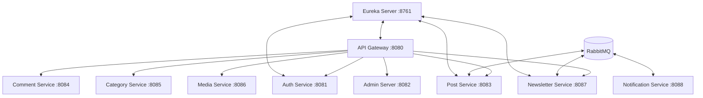

# InkWell 🖋️
> Write. Publish. Connect. Inspire.

InkWell is a state-of-the-art, premium blogging and newsletter platform built using a highly scalable, event-driven microservices architecture. It combines robust backend services, asynchronous message queues, distributed caching, and cloud integrations to deliver a seamless reading, writing, and social experience.

---

## 🏗️ System Architecture & Services
InkWell consists of **11 decoupled services** designed around a status-driven, distributed model:



### Core Microservices Overview:
1. **`api-gateway` (Port 8080)**: Single entry point handling request routing, JWT verification, and CORS.
2. **`eureka-server` (Port 8761)**: Service discovery registry enabling inter-service routing.
3. **`auth-service` (Port 8081)**: Manages authentication, custom OAuth2 (Google & GitHub), user profiles, and follow relationships.
4. **`post-service` (Port 8083)**: Manages posts, categories, view/like counts, and publishes RabbitMQ events upon publication.
5. **`newsletter-service` (Port 8087)**: Manages newsletter subscriptions and dispatches automated campaigns via Gmail SMTP using JavaMailSender.
6. **`notification-service` (Port 8088)**: Asynchronously consumes message queues to send real-time user notifications.
7. **`category-service` (Port 8085)**: Standardizes and maintains core publishing categories.
8. **`comment-service` (Port 8084)**: Handles real-time comments on articles.
9. **`media-service` (Port 8086)**: Securely uploads and serves media assets integrated with AWS S3.
10. **`admin-server` (Port 8082)**: Administrative control board.

---

## ⚡ Tech Stack & Cloud Integration
* **Backend Core**: Spring Boot (v3.4.2), Java 21, Hibernate/JPA.
* **Message Broker**: RabbitMQ (asynchronous publish/subscribe).
* **Caching**: Redis (distributed cache for high-frequency endpoints like trending posts).
* **Database Pooling**: HikariCP configured with optimal connection bounds.
* **Storage**: AWS S3 (Media asset storage).
* **Database**: AWS RDS MySQL.
* **Mailing System**: JavaMailSender configured with secure Gmail SMTP App Passwords.

---

## 🔄 Core Lifecycles (Follower & Newsletter Flow)
Our system implements a perfectly synchronized, status-driven lifecycle across multiple services:

### 1. Follower & Approval Flow
```
User clicks Follow 
  └─► auth-service saves as "PENDING"
        └─► Author approves Follow
              └─► auth-service transitions status to "ACCEPTED"
                    └─► Syncs to newsletter-service as "ACTIVE" Subscriber
```

### 2. Automatic Campaign Dispatch Flow
```
Author publishes a Post
  └─► post-service generates "slug"
        └─► Emits PostEvent containing slug to RabbitMQ
              └─► newsletter-service consumes event
                    └─► Fetches ACTIVE subscribers
                          └─► Dispatches email targeting: http://localhost:4200/blog/{slug}
```

---

## 🚀 Local Deployment Setup

### Prerequisites
* Docker & Docker Compose
* Java 21 (if running bare-metal)
* Maven

### Step 1: Configure Environment Variables
Each service folder contains a `.env.example` file. Copy these to create `.env` files for each service, and populate them with your credentials:
```bash
cp auth-service/.env.example auth-service/.env
cp newsletter-service/.env.example newsletter-service/.env
# Repeat for other services
```

### Step 2: Set Up Docker Compose
Use the provided `docker-compose.example.yml` as a template. Rename it to `docker-compose.yml` and provide your specific credentials for DB, Redis, SMTP, AWS, and OAuth.

### Step 3: Run the Ecosystem
To build and start all microservices locally in background mode:
```bash
docker compose up -d --build
```

---

## 🛡️ Security & Best Practices
* **SMTP Security**: All email-sending microservices use Google's 16-character App Passwords rather than plain text login credentials.
* **State Synchronization**: All databases are synced securely using RabbitMQ event consumers to guarantee eventual consistency across `auth`, `post`, and `newsletter` databases.
