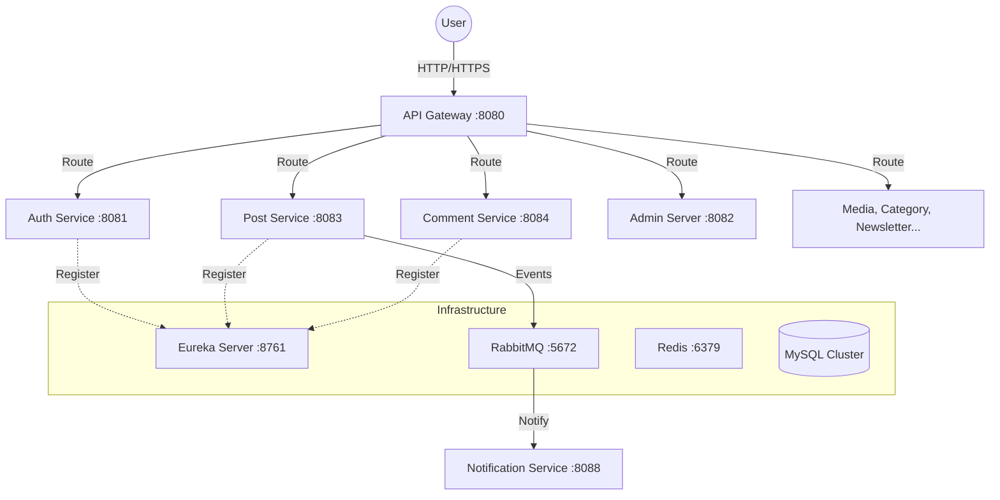

# InkWell — Project Documentation

## 1. Project Overview
**InkWell** is a modern, high-performance microservices-based blogging platform designed for creators, readers, and administrators. It provides a robust architecture for publishing content, managing communities through comments, and scaling via a distributed system.

The project follows a **Microservices Architecture** using **Spring Boot** for the backend and **Angular 17+** for the frontend, with all communication routed through a centralized **API Gateway**.

---

## 2. High-Level Architecture
InkWell is built on a distributed system where each service is independent, own its database, and communicates via REST and Message Queues.



---

## 3. Technology Stack

### Backend (Java Ecosystem)
- **Language:** Java 21
- **Framework:** Spring Boot 4.0.6 & Spring Cloud 2025.1.1
- **Security:** Spring Security, OAuth2 Client, JWT (jjwt 0.12.5)
- **Service Discovery:** Netflix Eureka
- **API Gateway:** Spring Cloud Gateway (Reactive/WebFlux)
- **Database:** MySQL 8+ (Per-service database pattern)
- **ORM:** Spring Data JPA / Hibernate
- **Communication:** REST (Inter-service via Feign/RestTemplate), RabbitMQ (Async Events)
- **Caching:** Redis (OTP Storage, Session Management)
- **Documentation:** OpenAPI 3 / Swagger

### Frontend (Angular Ecosystem)
- **Framework:** Angular 17+ (Standalone Components)
- **Styling:** Vanilla CSS / SCSS + Bootstrap 5
- **State Management:** Angular Signals
- **Editor:** TipTap / Quill.js
- **Environment:** Node.js 20+

### Infrastructure & DevOps
- **Containerization:** Docker & Docker Compose
- **Cloud Storage:** AWS S3 (Media Files)
- **Content Delivery:** AWS CloudFront
- **Email:** Spring JavaMailSender (Gmail SMTP / AWS SES)

---

## 4. Folder Structure

```text
InkWell/
├── admin-server/          # Platform administration & user management
├── api-gateway/           # Central entry point, JWT validation, CORS
├── auth-service/          # Identity provider, OAuth2, OTP, JWT issuance
├── category-service/      # Taxonomy, categories, and tags management
├── comment-service/       # Threaded comments and moderation
├── eureka-server/         # Service registry and discovery
├── inkwell-web/           # Angular 17+ Frontend Application
├── media-service/         # Image/File uploads via AWS S3
├── newsletter-service/    # Subscriber management and campaigns
├── notification-service/  # Real-time and email notifications
├── post-service/          # Core blogging engine (Posts, Likes, Feed)
├── docker-compose.yml     # Infrastructure orchestration (RabbitMQ, Redis)
└── projectdocumentation.md # This document
```

---

## 5. Backend Microservices Details

| Service Name | Port | Primary Responsibility | Controllers |
|---|---|---|---|
| **Eureka Server** | 8761 | Service Registration & Discovery | N/A |
| **API Gateway** | 8080 | Routing, JWT Filtering, CORS | `JwtAuthenticationFilter` |
| **Auth Service** | 8081 | Identity & Access Management | `AuthResource`, `AuthAdminResource` |
| **Post Service** | 8083 | Content Creation & Feed | `PostResource`, `PostAdminResource` |
| **Comment Service** | 8084 | Engagement & Moderation | `CommentResource`, `CommentAdminResource` |
| **Category Service**| 8085 | Content Taxonomy | `CategoryResource`, `CategoryAdminResource` |
| **Media Service** | 8086 | Asset Management (S3) | `MediaResource` |
| **Newsletter Svc** | 8087 | Subscription & Campaigns | `NewsletterResource` |
| **Notification Svc**| 8088 | User Alerts (Email/Push) | `NotificationResource` |
| **Admin Server** | 8082 | Global Platform Analytics | `AdminResource` |

### Internal Microservice Architecture
Each microservice follows a clean, layered architecture:
- **`resource/`**: REST Controllers handling HTTP requests.
- **`service/`**: Business logic implementation.
- **`domain/`**: JPA Entities (Database models).
- **`repository/`**: Spring Data JPA repositories.
- **`dto/`**: Data Transfer Objects for API requests/responses.
- **`config/`**: Service-specific configurations (Security, S3, RabbitMQ).
- **`exception/`**: Custom error handlers and exceptions.

---

## 6. Frontend Architecture (inkwell-web)

The frontend is built using **Standalone Components** for better modularity and performance.

### Key Directory Structure:
- `src/app/core/`: Singleton services, guards, and interceptors (e.g., `AuthInterceptor`).
- `src/app/features/`: Feature-based modules (Auth, Post, Profile, Admin).
- `src/app/shared/`: Reusable UI components (Navbar, Footer, PostCard).
- `src/app/models/`: TypeScript interfaces for backend DTOs.

---

## 7. Current Status & Achievements

### Recent Milestones
1.  **Infrastructure Stabilization:** Successfully deployed RabbitMQ and Redis via Docker to handle OTP delivery and caching.
2.  **Security Integration:** Completed JWT-based authentication and integrated **Google & GitHub OAuth2** flows.
3.  **Cross-Origin Support:** Centralized CORS management at the API Gateway level.
4.  **Microservice Connectivity:** All services are registered with Eureka and communicating via the Gateway.
5.  **Environment Management:** Implemented `.env` support across all services for secure configuration.
6.  **Media Handling:** Integrated AWS S3 for robust media storage in the `media-service`.
7.  **OTP System:** Built a custom OTP verification flow for secure user registration.

### In Progress
- Finalizing the Threaded Commenting system.
- Implementing Real-time Notifications via WebSockets.
- Enhancing the Admin Dashboard for platform-wide analytics.

---

## 8. How to Run

1.  **Infrastructure:**
    ```bash
    docker-compose up -d
    ```
2.  **Backend:**
    - Start `eureka-server` first.
    - Start `auth-service`.
    - Start all other domain services.
    - Start `api-gateway` last.
3.  **Frontend:**
    ```bash
    cd inkwell-web
    npm install
    npm start
    ```

---
*Last Updated: April 23, 2026*
